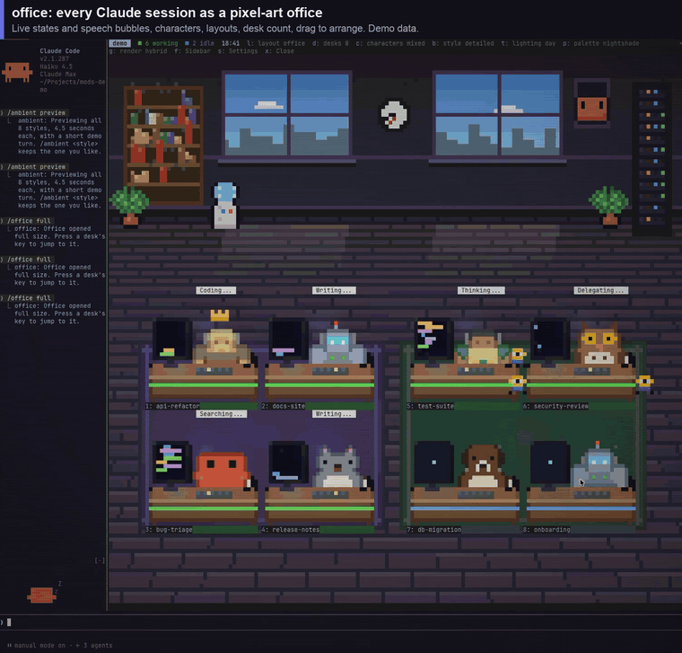
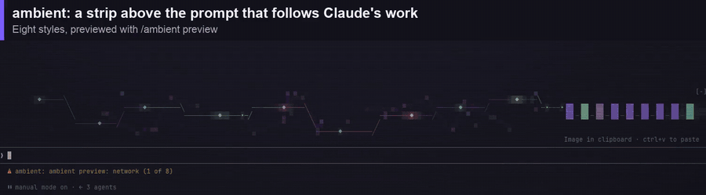

# Claude Code mods

Three mods for Claude Code. A mod is a plugin that runs inside Claude Code and can draw in its interface. See [Anthropic's mods docs](https://code.claude.com/docs/en/plugins/mods/overview).

| Mod | What it does |
|---|---|
| **office** | A pixel-art office of your running Claude Code sessions. One desk per session, animated by what it is doing, with speech bubbles ("Thinking...", "Coding...", "Help please", "Done"), layouts, characters and drag to arrange. |
| **viewfinder** | When Claude reads an image or takes a screenshot, the picture appears beside the transcript (or above the prompt in a narrow window). |
| **ambient** | An animated strip above the prompt that moves with Claude's work. Eight styles: network, critter, aurora, synthwave, warp, murmuration, lava and wave. |

## Demos

**office** ([full video](media/office.mp4), demo data)



**viewfinder** ([full video](media/viewfinder.mp4))


**ambient** ([full video](media/ambient.mp4))



## What you need

- Claude Code 2.1.287 or later (`claude --version`). Mods are on by default from that version.
- A terminal that shows images for the picture parts (office characters, viewfinder): Ghostty, kitty or WezTerm. Elsewhere they fall back to coloured blocks.
- Optional: [herdr](https://herdr.dev). With it, the office knows every pane and can jump to one. Without it, the office reads Claude Code's own list of running sessions.

## Install

In a Claude Code session:

```
/plugin marketplace add adamentwistle/claude-code-mods
/plugin install office@cc-mods
/plugin install viewfinder@cc-mods
/plugin install ambient@cc-mods
```

The repo is private, so Claude Code clones it with your own git credentials. Your account needs access to it. If your machine reaches GitHub through an SSH host alias, add the marketplace by its SSH URL instead, for example `/plugin marketplace add git@github-personal:adamentwistle/claude-code-mods.git`. A local clone works too: `/plugin marketplace add ./claude-code-mods`.

Then run `/reload-plugins`, or start a new session. `/plugin` lists the installed mods under **Installed**, where you can also turn each one off.

To try them without installing, clone the repo and start Claude Code with the folders:

```
claude --plugin-dir ./plugins/office --plugin-dir ./plugins/viewfinder --plugin-dir ./plugins/ambient
```

Running inside herdr? Start Claude Code with `CLAUDE_CODE_FORCE_TERMINAL_IMAGES=1` so pictures pass through herdr to the terminal.

## Use

**office**
- `/office` opens it beside the transcript, `/office full` gives it most of the screen, and `/office demo` shows a scripted demo office.
- Keys while it has focus: `1`-`9` jump to a desk, `l` layout, `c` characters, `d` desk count, `m` next page, `g` pictures or cells, `s` settings, `x` close.
- Drag a desk onto another with the mouse to rearrange.
- A standalone monitor needs no Claude session: `./plugins/office/bin/office-monitor --pictures` (`--help` for options).

**viewfinder**
- Opens by itself when Claude reads an image. `/viewfinder` opens it any time.
- Keys: `p`/`n` previous and next, `f` full size, `o` open in Preview, `y` copy the image, `w` copy its path, `c` close.

**ambient**
- `/ambient styles` lists the styles, `/ambient preview` plays them all, `/ambient preview <style>` plays one, and `/ambient <style>` picks one.
- `/ambient off` and `/ambient on` hide and show it.

Each mod's own README has the full detail and options. The options are also in `/config`.

## Good to know

- Mods run with your permissions, like any plugin. To see what each one reads and calls before installing, run `claude plugin validate ./plugins/<name>`.
- If no mod loads at all, run `claude plugin test` in an empty folder. "turned off in this process" means Anthropic has switched mods off remotely for now, and they come back on by themselves.
- The office never reads the `.key` files that sit next to Claude Code's session records.
- The office's detailed characters and furniture come from Kenney's free CC0 packs. See `plugins/office/assets/CREDITS.txt`.
- Tests: `claude plugin test ./plugins/<name>`.
